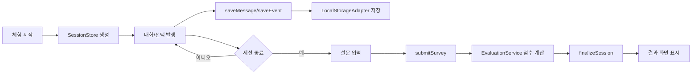

@@ -0,0 +1,172 @@
# 프론트-only 데모 아키텍처 + 추후 백엔드 전환 포인트

## 1) 목표와 전제
- 남은 기간(약 2일) 내에 **프론트만으로 동작하는 평가 데모**를 완성한다.
- 실제 운영 구조(로그 저장, 평가, 설문 반영, 카테고리 점수화)를 흉내 내되, 저장소는 브라우저 로컬로 대체한다.
- 이후 백엔드/DB가 준비되면 화면 로직을 최대한 건드리지 않고 데이터 어댑터만 교체한다.

---

## 2) 프론트-only 데모 아키텍처

### 2-1. 핵심 아이디어
- `API 호출처럼 보이는 함수`를 먼저 만든다.
- 현재 구현은 `localStorage`를 사용하는 `mock adapter`로 연결한다.
- 나중에 같은 함수 시그니처를 유지한 채 `http adapter`로 교체한다.

### 2-2. 구성 요소
1. `SessionStore`
- 현재 세션 상태 보관 (script, turn, actionEvents, survey, result)
- 예: Zustand/Redux/Context 중 팀이 쓰는 방식 유지

2. `EvaluationService`
- 행동 점수 계산 + 설문 반영 + 최종 라벨 산출
- LLM 평가는 실제 호출 대신 규칙 기반 점수 또는 미리 준비한 mock JSON 사용

3. `DataAdapter` 인터페이스
- `saveMessage()`
- `saveEvent()`
- `submitSurvey()`
- `finalizeSession()`
- `getResult()`

4. `LocalStorageAdapter` (현재 구현체)
- 세션 단위 JSON 저장/조회/업데이트
- 키 예시: `phishing-demo:session:{sessionId}`

### 2-3. 프론트-only 데이터 흐름


---

## 3) 데모 기준 데이터 구조(프론트 내부)

```ts
type SessionData = {
  sessionId: string;
  userId?: string;
  scriptId: string;
  channel: "chat" | "call";
  status: "in_progress" | "completed";
  startedAt: string;
  endedAt?: string;
  messages: Array<{
    turnIndex: number;
    speaker: "user" | "agent";
    text: string;
    timestamp: string;
  }>;
  actionEvents: Array<{
    eventType: "choice" | "hangup" | "report";
    actionCode: string; // safe_stop, risky_pay ...
    riskWeight: number; // -1.0 ~ +1.0
    stepNo: number;
    timestamp: string;
  }>;
  survey?: {
    realism: number;      // 1~5
    helpfulness: number;  // 1~5
    confidence: number;   // 1~5
    riskyFactor?: string; // 선택형
    skipped?: boolean;
  };
  evaluation?: {
    behaviorScore: number; // 0~100
    llmScore: number;      // mock 또는 규칙
    surveyScore: number;   // 0~100
    finalScore: number;    // 0~100
    label: "A" | "B" | "C" | "D" | "E";
    categoryScores: Array<{
      categoryCode: "detect_signal" | "refuse_request" | "verify_identity" | "reporting";
      score: number;
      label: "A" | "B" | "C" | "D" | "E";
    }>;
    educationTips: string[];
  };
};
```

---

## 4) 점수 계산(데모용 단순 규칙)

### 4-1. 행동 점수
- 기본 50점에서 시작
- 안전 행동 가점 / 위험 행동 감점
- 예:
  - `safe_stop`: +20
  - `report_police`: +15
  - `continue_chat`: -5
  - `shared_account`: -25
  - `risky_pay`: -35
- 최종 클램프: `0~100`

### 4-2. LLM 점수(데모 대체)
- 옵션 A: 시나리오별 고정 mock 값
- 옵션 B: 행동 점수를 기준으로 단순 보정 (`llmScore = behaviorScore ± 5`)

### 4-3. 설문 점수
- Likert(1~5) 평균을 100점으로 환산
- `surveyScore = ((avg - 1) / 4) * 100`
- 미응답이면 제외

### 4-4. 최종 점수
- 설문 있음: `final = 0.6*behavior + 0.25*llm + 0.15*survey`
- 설문 없음: `final = 0.7*behavior + 0.3*llm`

---

## 5) 추후 백엔드 전환 포인트

### 5-1. 교체 대상(핵심)
1. `LocalStorageAdapter` -> `HttpAdapter`
2. `EvaluationService` 내부의 mock LLM -> 서버 평가 API 호출

### 5-2. 유지 대상(가급적 유지)
1. 페이지/컴포넌트 구조
2. 사용자 플로우 (체험 -> 설문 -> 결과)
3. 점수 표시 UI 컴포넌트
4. `DataAdapter` 함수 시그니처

### 5-3. API 매핑 계획
- `saveMessage()` -> `POST /sessions/{id}/messages`
- `saveEvent()` -> `POST /sessions/{id}/events`
- `submitSurvey()` -> `POST /sessions/{id}/survey`
- `finalizeSession()` -> `POST /sessions/{id}/finalize`
- `getResult()` -> `GET /sessions/{id}/result`

### 5-4. 전환 체크리스트
1. `sessionId`를 서버 발급값으로 변경
2. 시간 필드(`startedAt`, `endedAt`)를 서버 기준 ISO 문자열로 통일
3. actionCode enum을 서버 스펙과 고정
4. 결과 라벨 기준(A~E)을 서버와 동일하게 고정
5. 로컬 mock 데이터 제거 후 네트워크 실패 처리 추가

---

## 6) 이틀 데모에서 반드시 보여줄 것
1. 행동 버튼 클릭 시 점수 변화가 반영되는 것
2. 종료 후 설문 입력/건너뛰기 분기
3. 최종 점수 + 카테고리별 결과 + 교육 팁 표시
4. 새로고침 후에도 `localStorage`에서 결과 복원 가능

---

## 7) 한계
- 현재는 브라우저 로컬 저장이므로 사용자 간 데이터 통합 분석 불가
- 서버 검증이 없어 데이터 신뢰성 낮음
- LLM 평가는 mock/규칙 기반으로 대체되어 운영 정확도와 차이 존재
- 본 데모는 UX/평가 흐름 검증 목적이며, 운영 단계에서 백엔드 연동 예정
