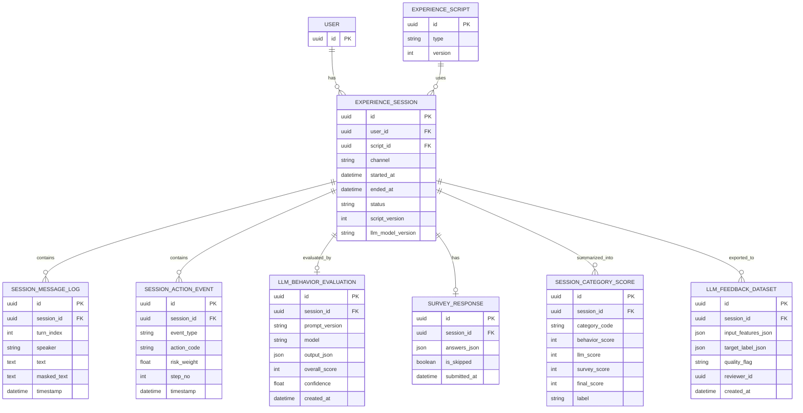

## 0) 설계 원칙(요약)

1. 대화용 LLM과 평가용 LLM을 분리된 호출로 운영 (역할이 2개)
2. 평가 단위는 `script`가 아니라 `experience_session`(사용자 1회 체험)으로 고정.
3. 점수는 `행동(핵심) + LLM 판정 + 설문(보정)` 3축 결합.
4. 모든 결과는 `카테고리별 점수`와 `최종 라벨`로 저장.
5. 추후 LLM 개선을 위해 `학습용 피드백 데이터셋`을 별도 적재.

---

## 1) 데이터 스키마(초안)

### 1-1. 예상 ERD



### 1-2. 핵심 테이블

**1) `experience_session`**

- 의미: 사용자의 모의 피싱 체험 1회를 나타내는 최상위 단위입니다.
- 필요 이유: 로그, 평가, 설문, 최종 점수를 모두 한 체험에 묶어야 하므로 기준축이 필요합니다.
- 핵심 컬럼:
    - `id` (uuid, pk): 세션 식별자
    - `user_id` (fk): 누가 체험했는지
    - `script_id` (fk): 어떤 시나리오로 체험했는지
    - `channel` (`chat` | `call`): 채팅/통화 구분
    - `started_at`, `ended_at`, `status`(`in_progress` | `completed` | `abandoned`): 세션 진행 상태
    - `script_version`, `llm_model_version`

**2) `session_message_log`**

- 의미: 세션 내 대화 원문 기록입니다.
- 필요 이유: LLM 행동평가의 근거 데이터이며, 사후 분석(어느 문장에서 위험 반응이 나왔는지)에 필수입니다.
- 핵심 컬럼:
    - `id` (uuid, pk)
    - `session_id` (fk): 어느 세션의 대화인지
    - `turn_index` (int): 몇 번째 턴인지
    - `speaker` (`user` | `agent`): 사용자/에이전트
    - `text`: 원문
    - `masked_text`: 개인정보 마스킹본(평가/학습용)
    - `timestamp`

**3) `session_action_event`**

- 의미: 버튼 클릭, 통화 종료, 신고 선택 등의 행동 이벤트 로그입니다.
- 필요 이유: 행동 기반 점수의 가장 직접적인 신호입니다.
- 핵심 컬럼:
    - `id` (uuid, pk)
    - `session_id` (fk)
    - `event_type`: choice/input/hangup/report
    - `action_code`: 안전/위험 행동 코드(`safe_stop`, `risky_pay` 등)
    - `risk_weight`: 행동 위험도 가중치
    - `step_no`: 시나리오 단계
    - `timestamp`
- 해석 포인트: 대화 텍스트가 애매해도, 행동 이벤트는 상대적으로 명확한 정답 신호가 됩니다.

**4) `llm_behavior_evaluation`**

- 의미: LLM이 해당 세션을 평가한 결과 저장본입니다.
- 필요 이유: 평가 결과 재현성과 버전 비교를 위해 “원문 JSON + 모델/프롬프트 버전”을 같이 저장해야 합니다.
- 핵심 컬럼:
    - `id` (uuid, pk)
    - `session_id` (fk)
    - `prompt_version`, `model`: 어떤 조건으로 평가했는지
    - `output_json`: 카테고리 점수, 근거, 경고 플래그 등 원문
    - `overall_score`, `confidence`: 요약 수치
    - `created_at`

**5) `survey_response`**

- 의미: 체험 직후 사용자 자기보고(현실감, 학습 도움, 자신감 등)입니다.
- 필요 이유: 행동 로그만으로는 측정하기 어려운 주관적 학습 효과를 보완합니다.
- 핵심 컬럼:
    - `id` (uuid, pk)
    - `session_id` (fk)
    - `answers_json`: Likert/선택형 응답
    - `submitted_at`
    - `is_skipped`: 설문 건너뛰기 여부(bool)

**6) `session_category_score`**

- 의미: 카테고리별 최종 반영 점수 테이블입니다.
- 필요 이유: 탐지/거절/검증/신고 같은 역량별 결과를 분리 저장해야 맞춤형 교육과 리포트가 가능합니다.
- 핵심 컬럼:
    - `llm_score` (0~100)
    - `id` (uuid, pk)
    - `session_id` (fk)
    - `category_code`: 평가 축 (예: `detect_signal`, `refuse_request`, `verify_identity`, `reporting`)
    - `behavior_score`, `llm_score`, `survey_score`: 원천별 점수
    - `final_score`, `label`: 결합 결과
- 운영 포인트: 이 테이블이 실제 사용자에게 보여주는 공식 결과의 기준이 됩니다.

**7) `llm_feedback_dataset`**

- 의미: LLM 개선 루프를 위한 학습/검증 데이터 적재소입니다.
- 필요 이유: 운영 데이터 전체를 바로 학습에 쓰면 노이즈가 커서, 품질 플래그를 둔 별도 큐가 필요합니다.
- 핵심 컬럼:
    - `id` (uuid, pk)
    - `session_id` (fk)
    - `input_features_json`: 모델 입력 특성
    - `target_label_json`: 목표 라벨(최종 점수/카테고리)
    - `quality_flag`: 신뢰도 구분
    - `reviewer_id`: 사람 검수 추적(nullable)

---

## 2) 평가 프롬프트 / 출력 JSON

### 2-1. LLM 평가 입력

- `script metadata` (유형/난이도/버전)
- `masked transcript`
- `action timeline`
- `session context` (채팅/통화, 소요시간, 중도 종료 여부)

### 2-2. SYSTEM 프롬프트(예시)

```
너는 모의 피싱 학습 세션 평가기다.
목표는 "사용자의 안전 대응 역량"을 카테고리별로 0~100 점수화하는 것이다.
추측하지 말고 로그 근거가 부족하면 evidence 부족으로 표시하라.
반드시 JSON만 출력하라.
```

### 2-3. 출력 JSON 스키마(예시)

```json
{
  "overall_score": 78,
  "confidence": 0.86,
  "categories": [
    {
      "category_code": "detect_signal",
      "score": 82,
      "label": "B",
      "evidence": ["긴급 송금 요구를 위험 신호로 인식", "의심 표현 후 추가 확인 질문"],
      "risk_flags": []
    },
    {
      "category_code": "refuse_request",
      "score": 65,
      "label": "C",
      "evidence": ["초기에는 대화 지속", "최종적으로 송금 거절"],
      "risk_flags": ["거절까지 지연"]
    }
  ],
  "critical_events": [
    {
      "turn_index": 8,
      "event": "shared_partial_info",
      "severity": "high"
    }
  ],
  "education_message": {
    "summary": "금전 요구 즉시 중단은 잘했으나, 초기 정보 제공을 줄여야 함",
    "tips": [
      "개인정보 질문 즉시 거절",
      "공식 채널로 역확인",
      "의심 시 신고/차단"
    ]
  }
}
```

---

## 3) 점수 산정 로직

### 3-1. 카테고리별 결합식

- `final_category_score` = 0.6*behavior + 0.25*llm + 0.15*survey
- 설문 미제출 시: `final_category_score` = 0.7*behavior + 0.3*llm
- `confidence < 0.55`면 `label`을 한 단계 하향
- 설문은 사용자의 주관이 너무 강한 이유로 행동 로그보다 낮은 가중치를 두는 게 맞다고 보여집니다.

### 3-2. 전체 점수

- `overall = 카테고리 가중 평균`
- 예시 가중치:
    - `detect_signal` 0.30
    - `refuse_request` 0.30
    - `verify_identity` 0.25
    - `reporting` 0.15

### 3-3. 라벨 기준

- `A`: 90~100
- `B`: 75~89
- `C`: 60~74
- `D`: 40~59
- `E`: 0~39

---

## 4) 화면 흐름(UX)

1. 체험 종료 직후 `평가 계산 중(1~2초)` 인터스티셜 표시.
2. `즉시 피드백 화면` 노출.
    - 핵심 결과: 전체 점수/라벨, 위험 행동 1~2개, 잘한 행동 1~2개
    - 즉시 행동 가이드: “다음에 이렇게 대응”
3. `설문 모달(20~30초)` 진입.
    - Likert 3문항 + 선택형 1문항
    - `건너뛰기` 제공
4. 설문 제출 후 `최종 결과 화면` 갱신.
    - 카테고리별 점수 레이더/바 차트
    - 개인 맞춤 교육 카드 2~3개
5. `다음 학습 추천`으로 종료.
    - 약점 카테고리 우선 시나리오 추천

---

## 5) API 설계 초안

1. `POST /sessions`
    - 세션 시작 생성
    - 응답: `session_id`
2. `POST /sessions/{id}/events`
    - 행동 로그 적재(`action_code`, `step_no`, `risk_weight`)
3. `POST /sessions/{id}/messages`
    - 대화 로그 적재(원문 + 마스킹본)
4. `POST /sessions/{id}/evaluate`
    - LLM 평가 실행(비동기 권장)
    - 응답: `evaluation_job_id`
5. `GET /sessions/{id}/evaluation`
    - LLM 평가 결과 조회(JSON 원문 + 요약)
6. `POST /sessions/{id}/survey`
    - 설문 저장
7. `POST /sessions/{id}/finalize`
    - 행동+LLM+설문 점수 결합, 카테고리 반영 저장
8. `GET /sessions/{id}/result`
    - 최종 점수/라벨/교육 카드 반환
9. `POST /llm-feedback/ingest`
    - 고신뢰 세션을 피드백 데이터셋으로 적재

---

## 6) LLM 재평가 루프 가능성(결론)

1. **데이터 정제 단계**
    - `high_confidence` 세션만 선별
    - 개인정보 마스킹/품질 검수
    - 사람 검토 샘플(예: 10~20%)로 기준 고정
2. **평가기 개선 단계**
    - 프롬프트 버전 A/B 테스트
    - 모델 버전별 오차 비교(사람 라벨 대비)
    - 성능지표: 카테고리별 정확도, 과대/과소평가율
3. **생성기 개선 단계**
    - 저득점 패턴을 다음 시나리오 생성 프롬프트에 반영
    - “취약 카테고리 강화” 시나리오 자동 추천

---

## 7) 예상 파이프라인

